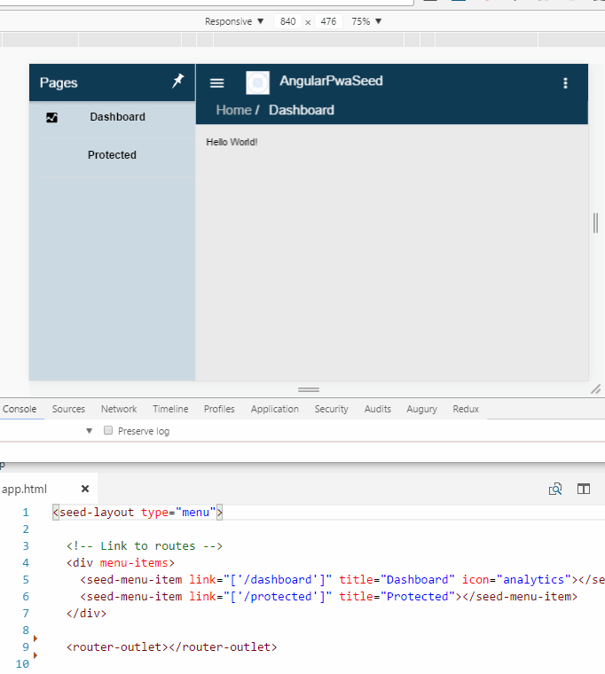

# Angular PWA Seed

[](https://gitter.im/angular-pwa-seed/Lobby?utm_source=badge&utm_medium=badge&utm_campaign=pr-badge&utm_content=badge)
[](http://opensource.org/licenses/MIT)
[](https://david-dm.org/jvitor83/angular-pwa-seed)
[](https://david-dm.org/jvitor83/angular-pwa-seed#info=devDependencies)
[](https://github.com/jvitor83/angular-pwa-seed)
[](https://pledgie.com/campaigns/32766)


## Description

**Multiplatform** [Angular](http://angular.io) project _([Web/PWA](https://developers.google.com/web/progressive-web-apps/), [Mobile and Desktop](https://cordova.apache.org/docs/en/latest/guide/support/index.html))_ with [Ionic](http://ionicframework.com/) applied.


## Sample

A sample is available at: https://angular-pwa-seed.netlify.com


> ## **TL;DR** _(Too Long; Didn't Read)_
> 
> _Just want to see this running on browser and android (if have the emulator already configured)!_
> 
> At shell/cmd run this _(windows only)_:
> ```Batchfile
> npm i -g yarn @angular/cli@1.2.7 cordova@6.5.0 ionic@2.2.3 typescript sleep-ms concurrently mkdirp && git clone https://github.com/jvitor83/angular-pwa-seed && cd angular-pwa-seed && yarn install & (IF DEFINED ANDROID_HOME npm run install.android) & npm run start.cordova
> ```


## Preview

[](https://angular-pwa-seed.netlify.com)


## Goal

Be the easiest, simplest, fastest and performative way to create a **Web(PWA)** using Angular.


> ### Secondary goal
> Allow _optionally_ to create an installable application _(and **reach the maximum performance possible**)_ using:
> - [x] [Crosswalk WebView](https://crosswalk-project.org/documentation/cordova.html)
> - [x] Simple layout (without complex animations/effects) based on Ionic - [KISS](https://en.wikipedia.org/wiki/KISS_principle)


## Features

- Multiplatform (Web, Mobile, Desktop) [Cordova](https://cordova.apache.org/docs/en/latest/guide/support/index.html)
- Multiples layouts out-of-box (Menu,Tab,Blank) ([Ionic](http://ionicframework.com/)/[Boostrap](http://getbootstrap.com/))
- [Authentication/Authorization (OpenID/OAuth2)](https://github.com/IdentityModel/oidc-client-js/wiki)
- VSCode Integration ([Debugger for Chrome](https://marketplace.visualstudio.com/items?itemName=msjsdiag.debugger-for-chrome), [Cordova Tools](https://marketplace.visualstudio.com/items?itemName=vsmobile.cordova-tools))
- Angular CLI project ([Generator commands](https://github.com/angular/angular-cli#generating-components-directives-pipes-and-services))

> ### Performance features
> - [x] [Angular Ahead-Of-Time Compilation](https://angular.io/docs/ts/latest/cookbook/aot-compiler.html)
> - [x] [Angular Lazy Loading Modules with PreloadAllModules Strategy](https://vsavkin.com/angular-router-preloading-modules-ba3c75e424cb)
> - [x] [Progressive Web App _Features_](https://developers.google.com/web/#progressive-web-apps) - Manifest and Offline _(for faster loading)_


> ### Developer Features
> _This Seed use Ionic to get the visual experience from each device/platform, be mobile friendly and performative. But it uses Ionic only at UI Components and Theming, the Router used is the **[Angular Router](https://angular.io/docs/ts/latest/guide/router.html)** and **not the [Ionic's NavController](https://ionicframework.com/docs/api/navigation/NavController/)**._
> - **PWA Already** - Manifest and ServiceWorker already configured (just need to host in HTTPS to get [A2HS](https://developers.google.com/web/fundamentals/engage-and-retain/app-install-banners/)).
> > The service-worker (offline) is updated at each publish `npm run publish.prod`, so no worry about updating the cache version.
> - **Multiple Layouts** - Choose between Menu, Tab and Blank Layouts
> > At `app.html` in `<seed-layout type="menu">`, choose your desired layout type
> - **Fast start** - Just by giving the name, color theme and icon.
> > Change the **config** section at `package.json`, create your icon at `resources/icon.png` _(for app)_ and `assets/logo.png` _(for enterprise)_, then run `npm run resources`
> - **Debugging** - Can debug easily
> > At VSCode, Run (debugging) just by pressing "<kbd>F5</kbd>"
> - **Simple responsive** - Choose when hide or show elements _(ex: if mobile or desktop)_.
> > Use the directive `invisible-to="mobile"` at any element/component to make it invisible when at mobile.
> - **Easy configuration** - Use the Angular CLI `environment.ts` for app's configuration.
> - **Flexibe authentication/authorization** - Authentication options is already setted (with google). Just choose your Identity Provider and change the `environment.ts` config.
> > Another option is to use `FirebaseAuthService` already implemented/configured just by using `{ provide: AUTH_SERVICE, useClass: FirebaseAuthService }` at `providers` in `app.module.ts` (instead of `OidcAuthService`).
> > 
> > You can easily implement your own Authentication Service just by extending the `BaseAuthService<any>` at `base-auth.service.ts`. An sample of this approach is at `firebase-auth.service.ts`
> >
> > You can use the `@Inject(AUTH_SERVICE) private authService: BaseAuthService<any>` at your service/component constructor to get user infos at `this.authService.auth.value.identity.user.name` or by subscribing to it `this.authService.auth.subscribe(auth => this.name = auth.identity.user.name);`
> - **Fast development** - Use the Angular CLI commands or [AngularDoc VSCode Extension](https://marketplace.visualstudio.com/items?itemName=AngularDoc.angulardoc-vscode) to generate your components/pages.
> > Ex: `ng g component new-cmp`. More info at [Angular CLI](https://github.com/angular/angular-cli#generating-components-directives-pipes-and-services)
> - **Components you choose** - It already has **[Ionic](https://ionicframework.com/docs/components/)** and **[Bootstrap](http://valor-software.com/ngx-bootstrap/)** installed, but you can include any other you want.
> > - Add **[PrimeNG](http://www.primefaces.org/primeng/)** components using this [guide](https://www.primefaces.org/primeng/#/setup) (Angular CLI Integration section)
> > - Add **[KendoUI](http://www.telerik.com/kendo-angular-ui/components/)** components using this [guide](http://www.telerik.com/kendo-angular-ui/getting-started/)


## Technologies

- [Angular](http://angular.io/)
- [Angular CLI](https://cli.angular.io/)
- [Ionic](http://ionicframework.com/)
- [Cordova](https://cordova.apache.org/)
- [Boostrap](http://getbootstrap.com/)
- [Firebase](https://firebase.google.com/)
- [OpenID/OAuth2 Client](https://github.com/IdentityModel/oidc-client-js)


## Requirements

- **GIT**: Have installed or Install GIT: [https://git-scm.com/downloads](https://git-scm.com/downloads)
- **NODE**: Have installed or Install NODE **(6+)**: [https://nodejs.org/en/download/releases/](https://nodejs.org/en/download/releases/) 
- **Install Global Dependencies**: `npm install --global yarn @angular/cli@1.2.7 cordova@6.5.0 ionic@2.2.3 typescript sleep-ms concurrently mkdirp`
- **Install Platform Requirements** _(optional if other different than web)_: See the **requirements** at **running** section according to your chosen platform. 

## Starting

```bash
# Install global dependencies
npm install --global yarn @angular/cli@1.2.7 cordova@6.5.0 ionic@2.2.3 typescript sleep-ms concurrently mkdirp

# Clone this repo giving your new project name
git clone https://github.com/jvitor83/angular-pwa-seed.git [your-project-name]

cd [your-project-name]

# Set your origin repository (can be later if wanted to)
git remote set-url origin [your-project-git-repo]

# Add this repository as upstream (to keep updated)
git remote add upstream https://github.com/jvitor83/angular-pwa-seed.git

# Execute those always when want to get the latest updates from the seed
git fetch upstream
git merge upstream/master

# Install the project's dependencies
yarn install

# (Optionally) Configure your project name, short_name and color at `package.json` and replace `./resources/icon.png` with the one of your project (must have 512x512)
npm run resources

# (Optionally) Start the project
npm run start
```


## Running

You could use:
- **[Angular-CLI commands](https://github.com/angular/angular-cli#usage)** to get it running on web (`ng serve`)
and/or
- **[Cordova commands](https://cordova.apache.org/docs/en/latest/guide/cli/index.html#build-the-app)** to get it running at others platforms (`cordova platform add android && cordova run android`).
> _Only remember to **first build the angular** `ng build` , **then run the cordova** `cordova run android`._

So, the steps are:

| Web              | Other Platforms (Cordova)                                                             |
|------------------|---------------------------------------------------------------------------------------|
| - Run `ng serve` | - Compile the App `ng build`                                                          |
|                  | - Install your desired platform **(one time only)** `cordova platform add android --save` |
|                  | - Run your desired platform `cordova run android`                                     |

> **[VSCode:](https://code.visualstudio.com/)** **Running on Web:** Just press <kbd>F5</kbd>


**Requirements:**

> Each platform has your specific requirements (SDK, Tools, environment) to compile/run.
> > _- Ex: To compile/run android, must have Android Studio or Android SDK installed and a emulator or device._

> > _- Ex: To compile windows, must have Visual Studio and be on windows to run._

> See the links below to know how to install each requirement.


**You could use some custom npm scripts/commands to install/run the platform:**


| PLATFORM       | REQUIREMENTS/*GUIDE (Tools, Sdk, etc)*                                                        | INSTALL                   | RUN                     |
|----------------|-----------------------------------------------------------------------------------------------|---------------------------|-------------------------|
| Web            |                                                                                               |                           | `npm run start`         |
| Android        | [Platform Guide](http://cordova.apache.org/docs/en/latest/guide/platforms/android/index.html) | `npm run install.android` | `npm run start.android` |
| IOS            | [Platform Guide](http://cordova.apache.org/docs/en/latest/guide/platforms/ios/index.html)     | `npm run install.ios`     | `npm run start.ios`     |
| Windows        | [Platform Guide](http://cordova.apache.org/docs/en/latest/guide/platforms/win8/index.html)    | `npm run install.windows` | `npm run start.windows` |
| OSx            | [Platform Guide](http://cordova.apache.org/docs/en/latest/guide/platforms/osx/index.html)     | `npm run install.osx`     | `npm run start.osx`     |
| Ubuntu (Linux) | [Platform Guide](http://cordova.apache.org/docs/en/latest/guide/platforms/ubuntu/index.html)  | `npm run install.ubuntu`  | `npm run start.ubuntu`  |
| Browser        |                                                                                               | `npm run install.browser` | `npm run start.browser` |


### Multiplatform

You can try multiple platform at same time using:
- Open shell then run `npm run start.mobile`
> _If you want to see it in a non-web emulator, then run `npm run start.cordova`_


## Structure

```
├── src                             <- source code of the application
│   ├── app                         <- angular components
```

More details at: [Angular CLI](https://cli.angular.io/) and [Ionic](http://ionicframework.com/docs/v2/components/)


## AddOns

### IDE:

#### [](https://code.visualstudio.com/) - Recommended extensions:
- [Debugger for Chrome](https://marketplace.visualstudio.com/items?itemName=msjsdiag.debugger-for-chrome)
- [Angular Language Services](https://marketplace.visualstudio.com/items?itemName=Angular.ng-template)
- [AngularDoc for Visual Studio Code](https://marketplace.visualstudio.com/items?itemName=AngularDoc.angulardoc-vscode)
- [Auto Import](https://marketplace.visualstudio.com/items?itemName=steoates.autoimport)
- [Cordova Tools](https://marketplace.visualstudio.com/items?itemName=vsmobile.cordova-tools)
- [Angular Snippets](https://marketplace.visualstudio.com/items?itemName=johnpapa.Angular2)
- [Ionic 2 Snippets](https://marketplace.visualstudio.com/items?itemName=oudZy.ionic2-snippets)
- [Ionic 2 Commands](https://marketplace.visualstudio.com/items?itemName=jgw9617.ionic2-vscode)
- [Bootstrap 3 Snippets](https://marketplace.visualstudio.com/items?itemName=wcwhitehead.bootstrap-3-snippets) or [Bootstrap 4 Snippets](https://marketplace.visualstudio.com/items?itemName=thekalinga.bootstrap4-vscode)

### Testing:

[](https://www.browserstack.com) - Testing against multiple browsers/platforms
